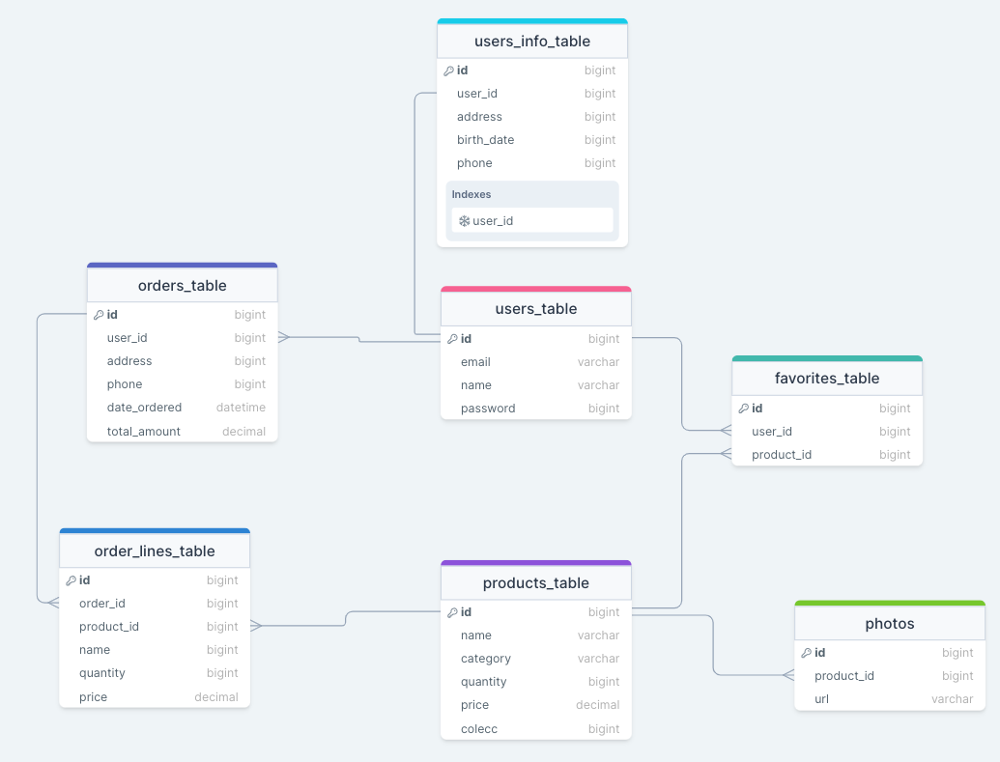

# NoxCR
En el marco del bootcamp de desarrollo fullstack de FemCoders, se ha abordado la tarea de realizar una página web tipo ecommerce de una tienda virtual de lentillas llamada `NoxCR`

## Sobre este proyecto
NoxCr tiene desde el año 2018 de estar en funcionamiento, ha estado utilizando plataformas como facebook e instagram para tener sus colecciones de lentillas pero estas plataformas no le gestionan todo lo que ella necesita, como un seguimiento mas personalizado de cada "Noxi" ó usuario y una pasarela de pago que le permita automatizar todos los procesos. La necesidad parte de toda la demanda que le ha surgido desde el año 2020, donde todo empieza a ser más digital y ella tiene que tomar decisiones digitales para llevar los productos a sus clientes.

## Objetivo del Proyecto
Una web responsive donde se pueda gestionar usuarios registrados, saber desde que fecha son usuarios y saber cuáles son las ofertas, promociones y regalías que se les hace dependiendo de la antigüedad. En la web los usuarios no registrados podrán ver todo el catalogo de lentillas y accesorios que vende la clienta, para poder acceder al carrito de compras el usuario se ha de registrar y podrá indicar el producto y la cantidad escogida para luego proceder con el pago, indicando con antelación el tipo de envío (inmediato o no) y así poder realizar la compra de los artículos en línea.

### Modelo de datos

[DrawSql](https://drawsql.app/teams/noxcr-1/diagrams/noxcr-db)

### Figma
#### Maqueta y propuesta al cliente
[Wireframe](./frontend//src/assets/propuesta-figma.png)

### Atomic Design
[Atomos](./frontend/src/assets/atomos.png)
[Moleculas](./frontend/src/assets/moleculas.png)
[Organismos](./frontend/src/assets/organismos.png)

### Final Design
[Desktop](./frontend/src/assets/desktop.png)
[Mobile](./frontend/src/assets/mobile.png)
[Administrador](./frontend/src/assets/admin.png)

### 🛠 Tecnologías Utilizadas

  

 

### 🛠 Herramientas Utilizadas

### 🛠 Otros paquetes utilizados

### Instrucciones de Uso
Para aprovechar al máximo esta versión del proyecto, es fundamental seguir cuidadosamente las instrucciones de instalación tanto para el frontend como para el backend. Antes de continuar, asegúrate de contar con los siguientes requisitos previos:

+ Conocimientos en Mamp/Xamp: Para ejecutar este proyecto de manera efectiva, es imprescindible tener un buen entendimiento de cómo funcionan entornos de desarrollo como Mamp o Xamp. Estos son sistemas que proporcionan un servidor web local, una base de datos y otros servicios necesarios para ejecutar aplicaciones web. Si no estás familiarizado con Mamp o Xamp, te recomendamos adquirir conocimientos básicos antes de continuar.

+ Composer instalado: es una herramienta esencial para gestionar las dependencias de PHP en tu proyecto. Asegúrate de que Composer esté instalado en tu sistema antes de proceder. Si no lo tienes instalado, puedes encontrar instrucciones detalladas en https://getcomposer.org/ para instalarlo.

+ Conocimientos en MySQL: Debes estar familiarizado con la creación de bases de datos para aprovechar al máximo las funcionalidades del proyecto.

A continuación, se detallan los pasos para la instalación:

**Instalación del Proyecto Backend Laravel**
 1. Clona el repositorio de Laravel desde GitHut
 `https://github.com/yana-tolstobrova/NoxCR.git`
 2. Abre el proyecto en tu editor de código y en la terminal ingresa al directorio del proyecto
 `cd backend`
 3. Instala las dependencias de Composer
 `composer install`
 4. Crea un archivo .env a partir del archivo .env.example.
 5. Crea tú base de datos en mysql con el nombre de tú preferencia.
 6. Configura la base de datos en el archivo .env con la información adecuada, donde debes poner el nombre de tu base de datos previamente creada en mysql y tener claro cual es tu sistema operativo para la instalación.Ejemplo:
 <pre>
<code>
DB_CONNECTION=mysql
DB_HOST=127.0.0.1
DB_PORT=3306
DB_DATABASE=nombre_base_de_datos
DB_USERNAME=nombre_usuario
DB_PASSWORD=contraseña
</code>
</pre>
7. Ejecuta las migraciones para crear las tablas de la base de datos
`php artisan migrate`
  - Si deseas ya tener información en tu base de datos te recomendamos hacer uso de los seeders, para eso debes ejecutar el comando
  `php artisan db:seed`
8. Inicia el servidor de desarrollo
`php artisan serve`

**Instalación del Proyecto Frontend React**

1. ingresa al directorio del proyecto
 `cd react-app`
2. Instala las dependencias de npm
`npm install`
3. Inicia el proyecto
`npm start`
4. El frontend de React ahora está en funcionamiento y se ejecuta en 
`http://localhost:3000`

###  Recursos Utilizados

Aquí encontrarás una lista de recursos y videos que nos inspiraron y/o que utilizamos en el desarrollo de este proyecto:

- [Login y registro](www.youtube.com/watch?v=bf_3ns1Anwg)
- [Tailwind](https://tailwindcomponents.com/)
- [Carrito de compra](https://www.youtube.com/watch?v=tsdzZhVJcRU)
- [Carrito de compra](https://www.youtube.com/watch?v=rQV9aI3LLnk)
- [Pasarela de pago por país](https://comunidad.apphive.io/t/pasarelas-de-pago-disponibles-por-pais/4435)
- [Testing React](https://www.youtube.com/watch?v=bTGil8qPmXo)
- [Testing Components](https://www.youtube.com/watch?v=FjJu3hcPSCY)
- [Imágenes más pequeñas](https://squoosh.app/)
- [Menu acordeon](https://codepen.io/sahdesigndesonhos/pen/xWLxrV)
- [Enviar Email](https://www.youtube.com/watch?v=6cxODPkoTMU)
- [Enviar Email](https://www.youtube.com/watch?v=giOjirSYksg)

## Developers
  [ Yana Tolstobrova](https://github.com/yana-tolstobrova) | [ Rosa Pedret](https://github.com/Rosapedret2) |  [ Cindy Leiva](https://github.com/CindyLeiva) | [ Sylvia Llorente](https://github.com/Sylviall81)| [ Mónica Blanco](https://github.com/mgblanco10)| [ Zoraida Moreno](https://github.com/ZoraidaMorenoCadenas) | 
| :---: | :---: | :---: | :---: | :---: | :---: | 